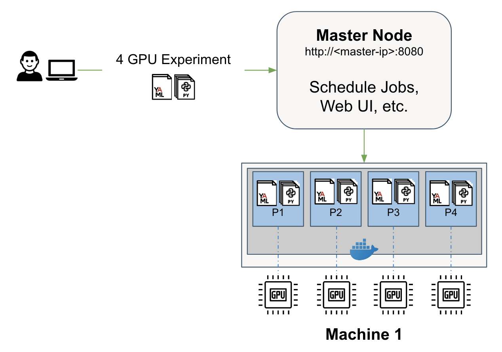
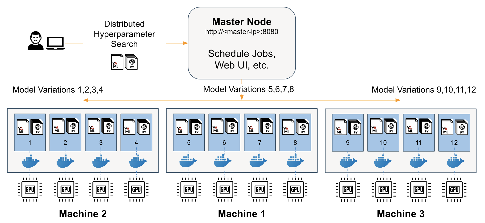
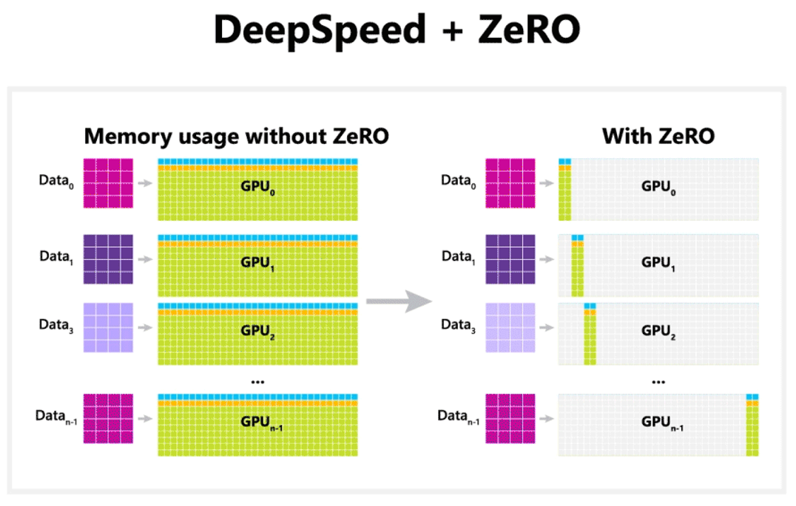

# det-finetuning-swallow-tokyotech-llm
Finetune Swallow - LLM models by Tokyo Institute of Technology - using HPE Machine Learning Development Environment (MLDE) callback with Hugging Face Trainer API to enable MLDE's distributed training, fault tolerance, checkpointing and metrics reporting.

# Why Swallow?

- Overview of Swallow

Swallow is an LLM developed by researchers at Tokyo Tech with enhanced Japanese capability, by extending the vocabulary of Llama 2 to include Japanese characters and continual pre-training on a large Japanese web corpus.
The performance of Swallow increased with the amount of training data up to 100B tokens through continual pre-training, and Swallow achieved competitive performance compared to other LLMs trained on English and Japanese datasets from scractch. 

Swallow paper: [Continual Pre-Training for Cross-Lingual LLM Adaptation: Enhancing Japanese Language Capabilities](https://arxiv.org/pdf/2404.17790)


- Why instruction tuning? 

Instruction finetuning is an efficient technique to enhance the capabilities and controllability of LLMs, addressing the issue of mismatch between the training objective and users' objective: LLMs are typically trained on minimizing the contextual next token generation (aka next word prediction); while users prefer LLMs to follow predefined instruction templates and return proper and safe answers in a controllable manner. In this demo, Swallow 70b instruct-v0.1 is used.

Model card on HF: [tokyotech-llm/Swallow-70b-instruct-v0.1](https://huggingface.co/tokyotech-llm/Swallow-70b-instruct-v0.1)

## Why HPE MLDE for finetuning LLMs at scale?


- Distributed training
With Determined, to scale an experiment/trial to multiple GPUs requires a single configuration line change. There is no need to worry about setting up frameworks like Horovod or PyTorch Distributed Data Parallel (DDP), or Pytorch Lightning.



- Hyperparameter search using Adaptive ASHA
To accelerate a search process, HPE MLDE leverages the Adaptive ASHA algorithm in order to find the best set of parameters in the hyperparameter space. 
The idea behind Adaptive ASHA is that we’ll run all the different model variations with different sets of hyperparameters in parallel, then we’ll stop the ones that are not performing well early and continue to train the ones that are performing well until convergence. 



- DeepSpeed integration
DeepSpeed API is a lightweight wrapper on PyTorch for training and inference of hyperscale DL models, ex., trillion parameter LLMs. DeepSpeed manages the boilerplate state-of-the-art training techniques, such as distributed training, mixed precision, gradient accumulation, and checkpoints so that users can focus on model development. DeepSpeed make training those models efficiently on 100s or 1000s of GPUs using techniques such as Zero Redundancy Optimizer (ZeRO), 3D parallelism that include data, model parallelism, and pipeline parallelism, and ZeRO-Infinity. 

In this demo, we'll show you how you can leverage DeepSpeed ZeRO stage 3 for finetuning Swallow on MLDE. DeepSpeed ZeRO stage 3 includes all optimizer state partitioning, gradient partitioning, and model parameter partitioning. 



Source: [ZeRO & DeepSpeed: New system optimizations enable training models with over 100 billion parameters](https://www.microsoft.com/en-us/research/blog/zero-deepspeed-new-system-optimizations-enable-training-models-with-over-100-billion-parameters/)

## How MLDE works with HF Trainer

While the BERT family models including ALBERT, BERT, DistilBERT, and RoBERTA are trained or finetuned using a masked language modelling (MLM) loss, later pretrained transformer based models including GPT, GPT-2, Llama, Mistral, Falcon, Phi, etc are trained or finetunde using a causal language modeling (CLM) loss. Find more information about the differences between those objectives in [this Transformer model summary](https://huggingface.co/docs/transformers/model_summary).

- HuggingFace Trainer's original *.py is located at /scripts/run_clm_hf.py

- Integration between HF Trainer and MLDE via MLDE callback

The main callback is located in determined.transformers and the associated DetCallback object is used in model code as in:
hf_callback.py
```bash
det_callback = DetCallback(training_args,
                            filter_metrics=["loss", "accuracy"],
                            tokenizer=feature_extractor)
trainer.add_callback(det_callback)
```
## Major changes in the code for integrating DetCallback

- Import Determined, Determined's DeepSpeed Auto Tuner (DSAT), and Determined Callback

```bash
import determined as det
from determined.pytorch import dsat
from hf_callback import DetCallback
```

- ModelArguments Class: No major changes. We want to add --use_lora attribute.

```bash
use_lora: bool = field(
        default=False,
        metadata={
            "help": "Whether to use preconfigured LoRA for parameter efficient finetuning via peft library."
```

- DataTrainingArguments Class: No major changes.

- def main() function: det_callback, tb_callback, model_args, data_agrs, and training_args are passed to the main() function.

```bash
def main(det_callback, tb_callback, model_args, data_args, training_args):
```

- DeepSpeed Autotune (DSAT):
[DSAT](https://hpe-mlde.determined.ai/latest/model-dev-guide/api-guides/apis-howto/deepspeed/autotuning.html#deepspeed-autotune-user-guide) helps users optimize setting many DS parameters on specific properties of hardware and model. This is done through and easy-to-use API with very few changes required in user-code. DSAT can be used with HuggingFace Trainer in this situation.

```bash
with dsat.dsat_reporting_context(core_context, op=det_callback.current_op):
            train_result = trainer.train(resume_from_checkpoint=checkpoint)
```
- Executive script under if __name__ == "__main__":

```bash
if __name__ == "__main__":
    info = det.get_cluster_info()
    assert info
    hparams = info.trial.hparams
    model_args, data_args, training_args = parse_input_arguments(hparams)
    if training_args.deepspeed:
        distributed = det.core.DistributedContext.from_deepspeed()
    else:
        distributed = det.core.DistributedContext.from_torch_distributed()

    with det.core.init(distributed=distributed) as core_context:
        user_data = {
            "finetuned_from": model_args.model_name_or_path,
            "tasks": "language-modeling",
            "dataset": data_args.dataset_name,
            "tags": ["language-modeling", "nlp"],
        }

        det_callback = DetCallback(core_context, training_args, user_data=user_data)

        tb_callback = TensorBoardCallback(
            tb_writer=SummaryWriter(core_context.train.get_tensorboard_path())
        )
        main(det_callback, tb_callback, model_args, data_args, training_args)
```
- Parsing arguments
```bash
def dict2args(hparams):
    out = []
    for key in hparams:
        out.append("--" + str(key))
        out.append(str(hparams[key]))
    return out


def parse_input_arguments(
    hparams: Dict[str, Any]
) -> Tuple[ModelArguments, DataTrainingArguments, TrainingArguments]:
    training_arguments = hparams.get("training_arguments", {})
    parser = HfArgumentParser((ModelArguments, DataTrainingArguments, TrainingArguments))
    if len(sys.argv) == 2 and sys.argv[1].endswith(".json"):
        # If we pass only one argument to the script and it's the path to a json file,
        # let's parse it to get our arguments.
        model_args, data_args, training_args = parser.parse_json_file(
            json_file=os.path.abspath(sys.argv[1])
        )
    else:
        args = sys.argv[1:]
        args.extend(dict2args(training_arguments))
        if any("--deepspeed" == arg.strip() for arg in args):
            args = dsat.get_hf_args_with_overwrites(args, hparams)
        model_args, data_args, training_args = parser.parse_args_into_dataclasses(
            args, look_for_args_file=False
        )
    return model_args, data_args, training_args
```
## Configuration file for running MLDE on DeepSpeed

swallow_70b_ds3.yaml
```bash
name: swallow_70b_ds3
debug: false
environment:
  image: determinedai/genai-train:latest
  environment_variables:
    - NCCL_DEBUG=INFO
    - HF_HOME=/hf_cache
    - NCCL_SOCKET_IFNAME=ens,eth,ib
resources:
  slots_per_trial: 4
  resource_pool: A100
searcher:
  name: single
  max_length:
    batches: 100
  metric: eval_loss
hyperparameters:
  deepspeed_config: ds_configs/ds_config_stage_3.json
  training_arguments:
    learning_rate: 1e-5
entrypoint: >-
  python -m determined.launch.deepspeed
  python run_clm.py
  --model_name_or_path tokyotech-llm/Swallow-70b-instruct-v0.1
  --dataset_name camel-ai/math
  --dataset_config_name default
  --do_train
  --do_eval
  --use_lora
  --torch_dtype float16
  --max_steps 100  
  --logging_strategy steps
  --logging_steps 10
  --output_dir /tmp/test-clm
  --eval_steps 10
  --evaluation_strategy steps
  --save_total_limit 1
  --seed 1337
  --save_strategy steps
  --save_steps 20
  --deepspeed ds_configs/ds_config_stage_3.json
  --per_device_train_batch_size 1
  --per_device_eval_batch_size 1
  --trust_remote_code false
  --fp16
max_restarts: 0
workspace: "poc"
project: "swallow"
```
DeepSpeed Configurations

ds_config_stage_3.json
```bash
{
  "fp16": {
    "enabled": "auto",
    "loss_scale": 0,
    "loss_scale_window": 1000,
    "initial_scale_power": 16,
    "hysteresis": 2,
    "min_loss_scale": 1
  },
  "optimizer": {
    "type": "AdamW",
    "params": {
      "lr": "auto",
      "betas": "auto",
      "eps": "auto",
      "weight_decay": "auto"
    }s
  },
  "scheduler": {
    "type": "WarmupLR",
    "params": {
      "warmup_min_lr": "auto",
      "warmup_max_lr": "auto",
      "warmup_num_steps": "auto"
    }
  },
  "zero_optimization": {
    "stage": 3,
    "overlap_comm": true,
    "contiguous_gradients": true,
    "sub_group_size": 1e9,
    "reduce_bucket_size": 5e8,
    "stage3_prefetch_bucket_size": 5e7,
    "stage3_param_persistence_threshold": 1e5,
    "stage3_max_live_parameters": 1e9,
    "stage3_max_reuse_distance": 1e9,
    "stage3_gather_16bit_weights_on_model_save": true
  },
  "gradient_accumulation_steps": "auto",
  "gradient_clipping": "auto",
  "train_batch_size": "auto",
  "train_micro_batch_size_per_gpu": "auto",
  "flops_profiler": {
    "enabled": true,
    "profile_step": 1,
    "module_depth": -1,
    "top_modules": 1,
    "detailed": true,
    "output_file": null
  }
}
```
- Package installation at start up 

requirements.txt

```yaml
setuptools==59.5.0
accelerate>=0.12.0
tokenizers>=0.13.3
datasets==2.18.0
evaluate==0.4.1
peft==0.10.0 
rouge_score==0.1.2
fire==0.6.0 
sentencepiece
scikit-learn
```
startup-hook.sh

```yaml
pip install -r requirements.txt
```

### How to launch a notebook in MLDE


```bash
# Go back one level from det_files/ to home directory
cd ..
det -m <master_address>:8080/ notebook start --config-file notebook.yaml -c .
```

When Jupyter Lab is launched, open `Finetune Swallow 70B.ipynb` and start interacting with the original and finetuned Swallow 70B models. 